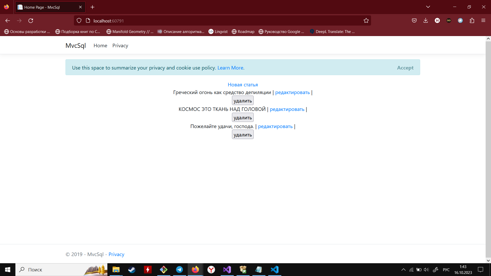

# Приложение  ASP.NET с взаимодействием с базой данных SQL.

**ТЗ на лабораторные работы:**
1) Создание ASP.NET, написание взаимодействия с базой
2) Создание представлений данных по работе с базой
3) Обработка данных с базы данных написание сервисов по обработке данных с базы данных

## Описание работы

В работе реализовано взаимодействие с SQL сервером (ms SQL server 2019). В базе данных сохраняются статьи представленный в ID, "Название статьи" - обязательные поля базы данных и "Содержание статьи" - не обязательное поле записи.

P.S. Прошу прощения, мои познания в C# и среды .NET не самые лучшие. Приложение написано по гайдам найденным в интернете.